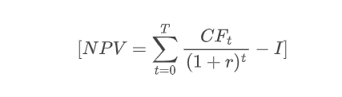
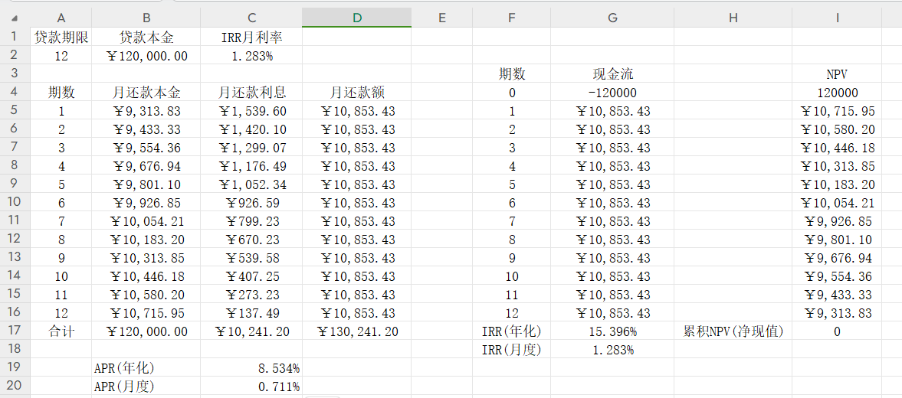
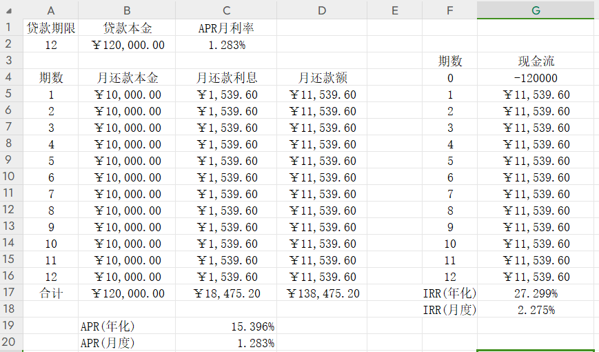

## IRR

### 概念

IRR：内部收益率(Internal Rate of Return)，也叫真实利率，是指资金流入现值总额与资金流出现值总额相等、净现值等于0时的折现率，关键是要考虑现金流与净现值的折现。

理解：比如期初借出了一笔款，分12期，此时期初资金是流出的，但随着时间的推移，每个月都有本金和利息的回款，此时每个月都有资金的流入，资金回流的节奏会影响手上可用资金池的大小，再加上有通货膨胀(比如今年1w可以购买的实物，5年后可能只能买到其中一部分)，也就意味着借出去的款，最后回款之后需要折算到放款时的现值，才能知道到底有没有跑赢通货膨胀，或者说快了多少，这就是净现值的折现。

> 净现值（Net Present Value，NPV）是一个财务指标，用于评估一个投资项目的盈利能力。它是将项目未来的现金流量折现到当前时间，减去项目的初始投资成本的总和。
>
> NPV的计算公式为：
>
> 
>
> 其中：
>
> - \( NPV \) 是净现值。
> - \( T \) 是项目的总期数。
> - \( CF_t \) 是每期的现金流量。
> - \( r \) 是贴现率（折现率）。
> - \( I \) 是项目的初始投资成本。
>
> 如果净现值为正数，表示项目有望盈利，而如果为负数，则表示项目可能会造成亏损。通常，对于投资决策来说，如果净现值为正，项目是可行的，而如果净现值为负，项目可能不值得投资。
>
> 贴现率 \( r \) 反映了投资项目的风险，通常是项目的机会成本或资本成本。如果贴现率为高，那么未来的现金流量的现值就会降低，对NPV产生更大的影响。

Q：净现值是反映项目盈亏的，那IRR、净现值、贴现率这三者关系是怎么样的？

A：贴现率是用于将未来现金流量折现到现值的利率。它反映了货币的时间价值，即未来的一笔金额在今天的价值。内部报酬率IRR指的是净现值等于0时的贴现率，考虑的是货币时间价值（通货膨胀贬值）下在项目周期内能承受的最大货币贬值率有多少，净现值NPV指的是考虑货币时间价值（通货膨胀贬值）下在项目周期内能赚多少钱，举个例子：某个项目的内部报酬率IRR是20%，说的是该项目最大能承受每年20%的货币贬值率，也就是在贷款年利率是20%的时候投资该项目刚好保本(净现值为0)，但当实际货币贬值率只有5%时，那么剩下的15%就是利润。在实际项目投资中，NPV指的是具体数值，而IRR是一个比率，如果要比较不同项目的盈利能力，应该综合考虑NPV和IRR，因为他们提供了不同角度的信息。

### 计算IRR

使用Excel计算IRR：

月还款本金=PPMT(月利率,期数,总期数,-贷款本金)

月还款利息=IPMT(月利率,期数,总期数,-贷款本金)

IRR(月度)=IRR(现金流范围)=IRR(G4:G16)

每期NPV=月还款额/(1+IRR(月度))

累积NPV=sum(每期NPV)-初始投资成本

> 注：excel中的累积NPV为0(也就是净现值为0)，也正说明了IRR是使净现值为0的折现率。

## APR

### 概念

APR：年度利率(Annual Percentage Rate)，也叫名义利率，可以理解为总利息除以借款本金就是APR利率

> 年利率=息费之和/借款本金

### 计算APR

月还款本金=贷款本金/期数

月还款利息=贷款本金*APR月利率

APR年化=sum(月还款利息)/贷款本金

### APR与IRR算法区别

irr算法，是按照贷款余额进行计息的，即当期利息的计息基数是**剩余贷款本金**

apr算法，是按照放款金额进行计息，即当期利息的计息基数是**贷款金额**

一般来说，同样的贷款本金和贷款期数，APR要比IRR小，很多信贷公司更倾向于向用户展示APR，而非真实利率IRR。