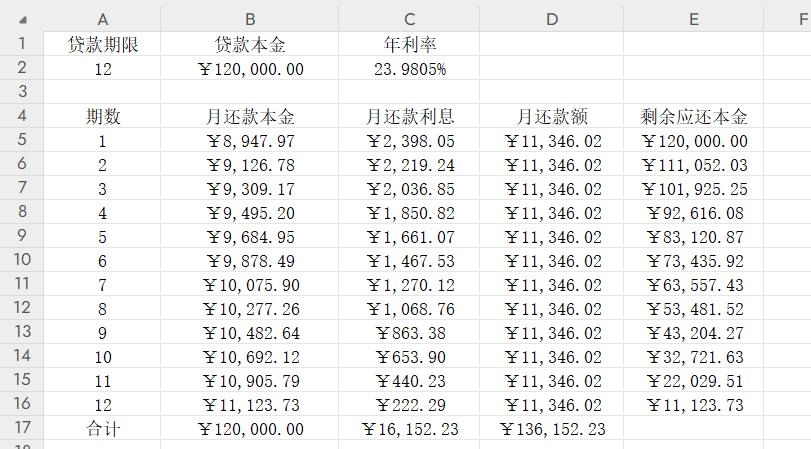
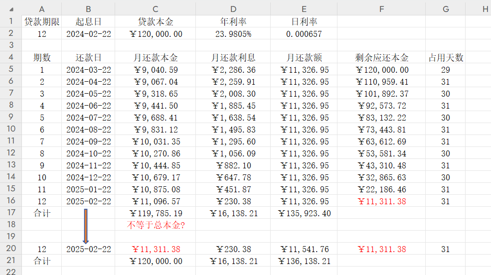
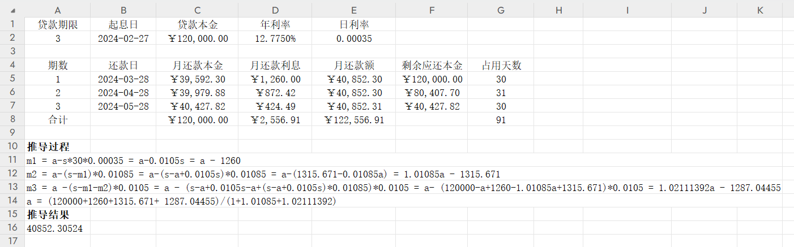

等额本息：借款期限内，每期以相等的金额偿还贷款本息，其中利息逐月递减，本金逐月递增。因为每期的还款额相等，每期利息的计息基数是**剩余贷款本金**，所以在贷款初期每期的还款中，利息计息基数较大，利息较多，剔除利息后，所还的贷款本金就较少，而在贷款末期，随着剩余贷款本金的逐渐减少，末期每期利息也相对减少，所还贷款本金就相对增加。等额本息是住房贷款的两种常见还款方式之一，其贷款计算公式如下：

$$每期偿还金额 = \frac{贷款本金\times月利率\times(1+月利率)^{借款期数}}{(1+月利率)^{借款期数}-1}$$

在贷款领域中，一般都是使用年利率展示，然后通过年利率换算月利率，套用贷款计算公式，算出每期偿还金额，举个例子：

> 比如借款120000，分12期，年利率23.9805%，月还款利息 = 剩余应还本金 * 月利率 = 剩余应还本金 * 年利率/12
>
> 使用Excel列出还款计划（可以发现每月还款额是固定相等的）：
>
> 

可以看到，上面的月还款利息直接通过月利率计算，实际是将每个月当做了30天来算出每月还款利息，但很多贷款产品是需要计算每期的占用天数的，以满足法规要求和提高计划的精确性，可以说是按日计息。因此在实际计算每期还款利息的时候使用日利率，月利率则使用日利率按30天换算，具体计算方式如下：
$$
每期还款利息 = 剩余应还本金 \times 日利率 \times 每期占用天数 \\
月利率 = 日利率 \times 30 \\  或者 \ 月利率 = 年利率 ÷ 12
$$
这种做法也是为了方便计算和表达，在金融行业中比较常见。这样的计算方式还需要注意一些细节。通常，从年利率到日利率的转换是通过除以年份的天数（通常取365天）来完成的，因为一年通常被视为365天。这样的转换是一种近似，而不是准确的数学计算。具体计算方式如下：
$$
日利率=年利率 ÷ 365
$$

> 注意：月利率 = 日利率 * 30 = 年利率 ÷ 365 * 30 跟 月利率 = 年利率 ÷ 12 的差异 ，后者直接是将一年作为了360天算。

然后，可以使用等额本息的公式来计算每月还款额，其中月利率、日利率取上述计算得到的值。这种转换方式在实际应用中比较常见，因为这样使得利率的表达更为直观，但需要注意的是，这种方式是一个近似值，在等额本息计算中，每期还款额需要根据相同的计息周期来确定，以确保还款额的一致性。使用日利率可能会引入更多的复杂性，因为不同月份的天数不同，导致每个月的计算方式不一样。

就我所知的举个例子，有些贷款产品使用日利率是怎么计算等额本息还款计划的：

> 比如借款120000，分12期，年利率23.9805%，日利率0.000657，以02-22作为起息日
>
> 日利率 = 年利率 / 365 = 0.000657（本例子采用一年365天这种计算方式）
>
> 月利率 = 日利率 * 30 = 0.019710（本例子先算出日利率，再用30天来算出月利率，只是一个近似值，存在偏差）
>
> 每期偿还金额 = 11326.95（按照公式计算得出）
>
> 第1个月还款利息 = 120000 * 0.000657 * 29(首期天数，本金占用天数) = 2286.36，首期还款日是03-22，按照算头不算尾的原则，本金占用天数一共是29天
>
> 第1个月还款本金 = 每期偿还金额 - 第1个月还款利息 = 11326.95 - 2286.36 = 9040.59
>
> 依此类推，使用Excel列出还款计划：
>
> 
>
> 可以看到按照这种方式计算，最终的本金合计与总本金不相等。这是因为每期的占用天数不同，导致每个月的计算方式存在差异，从而产生偏差。因此，采用这种计算方式的贷款产品在最后一期时直接将剩余本金用作最后一期的还款本金，从而实现总本金的匹配。然而，这样做会导致最后一期的月还款额与之前期数的月还款额不相等，因此这种方式并非严格的等额本息。
>
> java实现具体看 `EqualityPrinAndIntUtil.java`

再举例说明借呗的等额本息计算方式，其计算方式又略有不同之处：

> 比如借款120000，分3期，年利率12.775%，日利率0.00035，以02-27作为起息日，还款日为28号
>
> 日利率 = 年利率 / 365 = 0.00035
>
> 借呗的每月等额计算略有不同之处在于，其不是直接使用月利率套用公式算出每月偿还金额，而是通过推导来计算出每月偿还金额，这种做法在我看来更精确
>
> 首先假设每月等额偿还金额为a，贷款本金为s，日利率为p，计算推导如下：
>
> 1. 第一期月还款本金 m1 = a - s &times; p &times; 第一期占用天数 = a - 120000 &times; 0.00035 &times; 30 （第一期还款日为03-28，占用30天）
>
> 2. 第二期月还款本金 m2 = a - (s-m1) &times; p &times; 第二期占用天数 = a - (120000-m1) &times; 0.00035 &times; 31 (第二期还款日为04-28，占用31天)
>
> 3. 第三期月还款本金 m3 = a - (s-m1-m2) &times; p &times; 第三期占用天数 = a -(120000-m1-m2) &times; 0.00035 &times; 30 （第三期还款日为30天）
>
> 4. m1 + m2 + m3 = 120000
>
> 最后计算得出 a = 40852.30524 &asymp; 40852.30，Excel列出还款计划如下：
>
> 
>
> 最后产生的一分钱误差算入最后一期（抹平尾差）。
>
> 这种计算方式在java中不易实现，可以通过迭代或者其他数值方法求解（本人试了下，都无法求出精确值），但用python可以求解出精确值：
>
> ```python
> from sympy import symbols, Eq, solve
> 
> # 定义符号
> a, s, p, m1, m2, m3 = symbols('a s p m1 m2 m3')
> 
> # 已知条件
> p_value = 0.00035
> s_value = 120000
> total_m = 120000
> 
> # 方程
> eq1 = Eq(m1, a - s*30*p)
> eq2 = Eq(m2, a - (s-m1)*31*p)
> eq3 = Eq(m3, a -(s-m1-m2)*30*p)
> eq4 = Eq(m1 + m2 + m3, total_m)
> 
> # 代入已知的p和s值
> eq1 = eq1.subs({p: p_value, s: s_value})
> eq2 = eq2.subs({p: p_value, s: s_value})
> eq3 = eq3.subs({p: p_value, s: s_value})
> 
> # 解方程求a
> solution = solve((eq1, eq2, eq3, eq4), (a, m1, m2, m3))
> 
> print(solution[a])
> ```